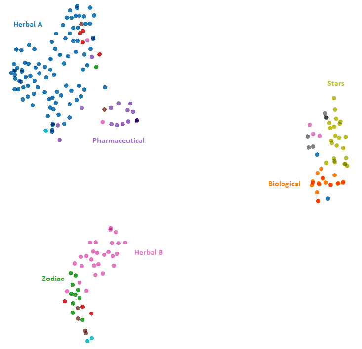
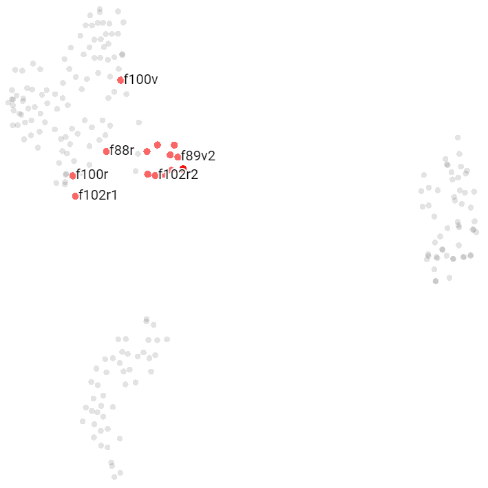
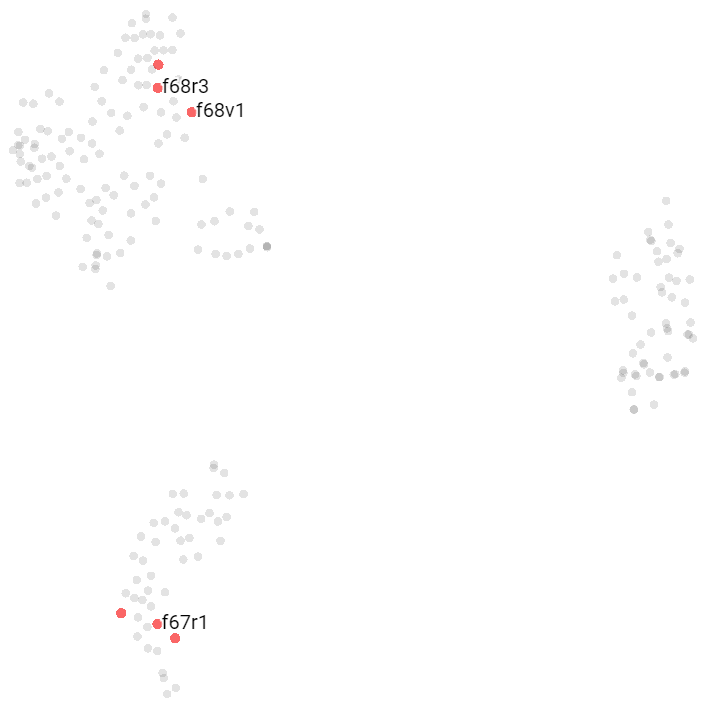
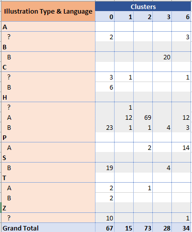
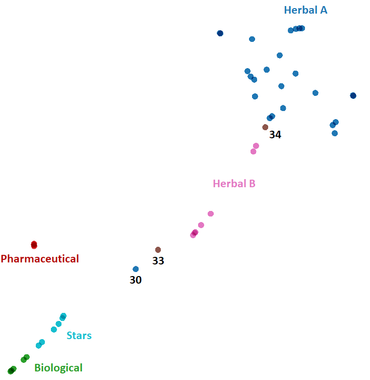
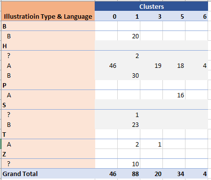
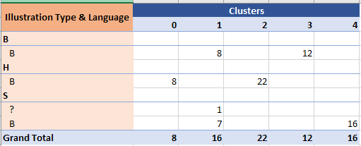

## Note 003 - Clustering

_Last updated Mar. 20th, 2022._

_This note refers to [release v.3.0.0](https://github.com/mzattera/v4j/tree/v.3.0.0) of v4j;
**links to classes and files refer to this release** and files might have been changed, deleted or moved in the current master branch.
In addition, some of this note content might have become obsolete in more recent versions of the library._

_Working notes are not providing detailed description of algorithms and classes used; for this, please refer to the 
library code and JavaDoc._

_Please refer to the [home page](..) for a set of definitions that might be relevant for this working note._

[**<< Home**](..)

---

# Abstract

This note discuss the application of k-means clustering algorithms to Voynich pages, showing how the word types in the page 
strongly correlate with the page illustration type (Herbal, Biological, Pharmaceutical, etc.) and Currier's language (see [CURRIER (1976)](../biblio.md)).

# Previous Works

I am not the first one to apply this approach to the Voynich, just
[google "Voynich clustering"](https://www.google.com/search?q=Voynich+clustering)
and you will find many articles and blog posts o the topic.

Probably one of the first works in this area was that by D'Imperio ([D'IMPERIO [1978a](../biblio.md)).

I reserve the option to go over these publications in the future and compare them with the contents of this note.

# Methodology

Our starting point is the Voynich majority transliteration of the text (see [v4j README](https://github.com/mzattera/v4j#ivtff));
I use the EVA alphabet, but it is not relevant for this discussion, as I look at whole words in the Voynich, not to their inner components.

## Embedding and Distance Measure

The text is split into units for analysis, that could be single pages or bigger portions of text (e.g. parchments / bi-folios).
Each unit is embedded as a bag of words where the dimensions are the "readable" word types in the Voynich (that is, Voynich "words" with no
"unreadable" characters [{1}](#Note1))
and the value for the dimension is the number of times corresponding word type appears in the text unit.

Similarity between textual units is computed as positive angular distance of corresponding embedding; this returns angular distance
between two vectors assumed to have only positive components.

## Outliers

Before clustering, I look for "outliers"; that is, textual units which appear very dissimilar from other textual units.

Based on this analysis [{2}](#Note2)), I defined the following outliers, which are removed from the text before clustering.

- **f27v**, **f53r**: Herbal A pages, that do not look different from others to the naked eye.
- **f57v**: 8 circles with words; part of a strange parchments including 2 Herbal B pages and f66r, a text-only page with text
arranged in 3 columns.
- **f65r**: Big plant illustration; only text is a 3-words label.
- **f68r2**, **f68r1**: Astronomical pages, with stars and labels associated to them.
- **f72v1**: the "libra" Zodiac page.
- **f116v**: Short text  written in "Michitonese" that seems a mix between Latin alphabet and the VMs script.

## Preliminary Exploration

The [TensorBoard Embedding Projector](https://projector.tensorflow.org/) has been used to do a preliminary, quick and visual investigation
about clustering Voynich pages [{3}](#Note3).

The below images have been obtained using the projector with following parameters;
; a
[pre-populated version](https://projector.tensorflow.org/?config=https://mzattera.github.io/v4j/003/data/projector_config.json),
is available for your own exploration.
```T-SNE 2D projection, Label By=ID, Color By=Illustration + Language, Perplexity=5, Learning rate=0.01, Supervise=0, Iteration=10'000```.
 


#### Currier's Language

The image below shows how pages tend to form three distinct clusters, which are highly correlated with Currier's languages (A or B).

- A cluster of pages using A language (in blue on top-left of the image), composed mostly by Pharmaceutical and Herbal A pages.
- A cluster of pages using B language (in purple on right of the image), composed mostly by Biological and Stars pages.
- A cluster with Zodiac pages (in red on the bottom-left), for which the language is not provided,
  together with Herbal pages using B language (in purple on the bottom-left).
 


#### Biological Pages

These pages cluster closely together.
 


#### Stars Pages

The stars pages tend to cluster together, next to the Biological pages (they are all written in Currier's B language).
 


#### Herbal B Pages

The herbal pages written with Currier's language B tend to cluster together, well separated from Herbal A pages.
 


#### Zodiac Pages

The zodiac pages tend to cluster together, next to Herbal B pages.
 


#### Herbal A Pages

The herbal pages written with Currier's language A tend to cluster together, well separated from Herbal B pages.
 


#### Pharmaceutical Pages

Those pages tend to cluster together, next to but separated from Herbal A; to be noticed that all Pharmaceutical pages are written
using Currier's language A.
 


#### Astronomical Pages

These pages are grouped in two big parchments; f67 and f68.

- f67r1, f67r2, and f68v2 are in the Zodiac cluster.
- f67v1 & f67v2 (technically a Cosmological page), f68v1, and f68r3 are in the Herbal A cluster.
- f68v3 (technically a Cosmological page) is in the Pharmaceutical cluster. 
- f68r1 and f68r2 are outliers.
 


#### Cosmological Pages

These pages tend to disperse in the dimension space.

- f69r, f69v , f70r1 and f70r2 (the verso of f70 being classified as Zodiac) are next to the Zodiac cluster.
- f85r2 is in the Language B cluster, together with f85r1 (which contains only Text) and f86v3-6; these are part of the fRos ("Big Rosetta") parchment, which clusters nearby.
- f57v is an outlier.
 


## K-Means Clustering

The below table summarizes the result of clustering the manuscript pages using K-Means clustering [{4}](#Note4):



We can see that:

- Biological pages are clearly clustered in their own cluster (#3).

- Other pages using language B (Cosmological, Stars and Herbal B) are grouped in the same cluster (#0).

- Herbal A and Pharmaceutical pages are in the remaining clusters;
  Herbal A is split in a bigger (#2) and a smaller (#1) group, while Pharmaceutical pages are grouped together
  with remaining Herbal A pages (#6).
  
In order to remove some noise, and noticing that in the vast majority of cases pages
in a parchment share illustration type and language, I performed the clustering again, this time
splitting the manuscript by parchment. Notice that parchments 29, 31, 32, 40 have been excluded
as they contain Cosmological or Astronomical pages, which we know already do not cluster well.

The results are shown below (they are also available in
[the TensorFlow projector](https://projector.tensorflow.org/?config=https://mzattera.github.io/v4j/003/data/projector_config_parchments.json));
following parameters have been used:
```T-SNE 2D projection, Label By=ID, Color By=Illustration + Language, Perplexity=5, Learning rate=1, Supervise=0, Iteration=1'000```. 



We can see that there a strong tendency for parchments to cluster based on their illustration type and language, with two notable exceptions:

- Zodiac pages (parchments 33 and 34) which tend to remain separate.

- Parchment 30 which indeed is a strange bi-folio combining two text pages, which also show stars (f58v and f58r), and
  two herbal pages; f65r which is an outlier containing a single label with three words, and f65v[{6}](#Note6).
  
  This parchment will be excluded from further processing.

K-Means clustering of the parchments, confirms what I already found while clustering single pages
(table shows page count for each cluster, some of the smallest clusters omitted for clarity):



I had a further deeper look into language A and B separately.

The below image shows the results of clustering Pharmaceutical and Herbal A parchments
(table shows page count for each cluster, some of the smallest clusters omitted for clarity):


- Pharmaceutical pages stick together.

- There might be an indication that the big cluster of Herbal A pages can be further broken down
in smaller clusters, but it might be an artifact of K-Means.

The below image shows the results of clustering Biological, Stars, and Herbal B parchments
(table shows page count for each cluster, some of the smallest clusters omitted for clarity):



- Herbal B pages cluster together, separated from Biological and Stars.

- Biological and Stars form two distinct clusters, even if with some small overlapping.


# Conclusions 

Based on the above clustering analysis we can conclude that:

- Pages written using Currier's language A look quite different from pages using language B.

- Pages tend to cluster in groups that are strongly correlated with illustration type and language.
This is more evident when clustering whole parchments instead of single pages.

  - **Herbal A** pages form a big cluster, there _might_ be an indication of sub-clusters inside this group, but it can well be an artifact.

  - **Pharmaceutical** pages form a tight group, next to Herbal A.
  
  - **Herbal B** pages form their own group.
  
  - **Biological** and **Stars** pages form two close, albeit separate, groups.
  
  - The grouping behavior of remaining pages (**Astronomical**, **Text**, **Zodiac** and **Cosmological**)
  is more difficult to assess.

- It has been already proposed (_citation needed_) that these similarities are either a proof that the Voynich is not an hoax
as the vocabulary used in its page correlates with the page "topics" that can be inferred by the illustration type
(this will not explain the differences between Herbal A and Herbal B pages though). Similarly, it can be argued that 
Currier's languages reflect language differences in the underlying plain text.

  However, it can be that these similarities reflect a different technique (or variations of the same technique) used to create
  the parchments. This technique could be either a proper cypher or a way to produce "random" text.  

- As the above grouping reflects a similar distribution of word types in the text, no matter what was the cause,
these differences should be kept in mind when performing statistical analysis of the text or when trying to decipher it.

  For this reason, v4j library provides means to classify pages accordingly to above considerations, the resulting clusters are shown below[{5}](#Note5)
  (also see [`PageHeader`](https://github.com/mzattera/v4j/blob/v.3.0.0/eclipse/io.github.mattera.v4j/src/main/java/io/github/mattera/v4j/text/ivtff/PageHeader.java) class).
 
  

	
---

**Notes**

<a id="Note1">**{1}**</a> See [v4j README](https://github.com/mzattera/v4j#alphabet).

<a id="Note2">**{2}**</a> The class
[`OutlierDetection`](https://github.com/mzattera/v4j/blob/v.3.0.0/eclipse/io.github.mzattera.v4j-apps/src/main/java/io/github/mzattera/v4j/applications/clustering/OutlierDetection.java)
is used to calculate average distance of each page from other pages in the text. The output of the class (`PageEmbeddingDistance.xlsx`) can be found in the
[analysis folder](https://github.com/mzattera/v4j/tree/master/resources/analysis).

<a id="Note3">**{3}**</a> The class
[`BuildBoW`](https://github.com/mzattera/v4j/blob/v.3.0.0/eclipse/io.github.mzattera.v4j-apps/src/main/java/io/github/mzattera/v4j/applications/clustering/BuildBoW.java)
can be used to generate data that can be uploaded to TensorFlow projector for visualization.
The output of this class, in the form of "vector" and "metadata" .TSV files, can be found in
[this folder](https://github.com/mzattera/v4j/tree/master/docs/003/data) both for single pages or entire parchments.

<a id="Note4">**{4}**</a> Class
[`KMeansClusterByWords`](https://github.com/mzattera/v4j/blob/v.3.0.0/eclipse/io.github.mzattera.v4j-apps/src/main/java/io/github/mzattera/v4j/applications/clustering/KMeansClusterByWords.java)
performs K-Means clustering and prints out a report that can be easily converted in an Excel file.
The class can be parameterized to run different types of experiments; its outputs, with some additional data,
can be found as Excel files in the [analysis folder](https://github.com/mzattera/v4j/tree/master/resources/analysis).
Keep in mind K-Means algorithm include some randomness, therefore slightly different clustering might result at each experiment.

<a id="Note5">**{5}**</a> After publishing [note 009](../009), I decided to remove the zodiac pages (former "ZZ" cluster) from this list of clusters,
since there is no much evidence their cluster is better formed than Cosmological or Astronomical ones.

<a id="Note6">**{6}**</a> [CURRIER (1976)](../biblio.md) contains this comment:
"The Newbold foliation indicates that the Biological Section extends through ff 85-86 and it would appear from the illustrations that the Pharmaceutical Section does not
begin until f 87. However, frequency counts before and after the break at f 84/f 85 indicate a change from Biological material to something else.".


---

[**<< Home**](..)

Copyright Massimiliano Zattera.

<a rel="license" href="http://creativecommons.org/licenses/by-nc-sa/4.0/"></a><br />This work is licensed under a <a rel="license" href="http://creativecommons.org/licenses/by-nc-sa/4.0/">Creative Commons Attribution-NonCommercial-ShareAlike 4.0 International License</a>.
