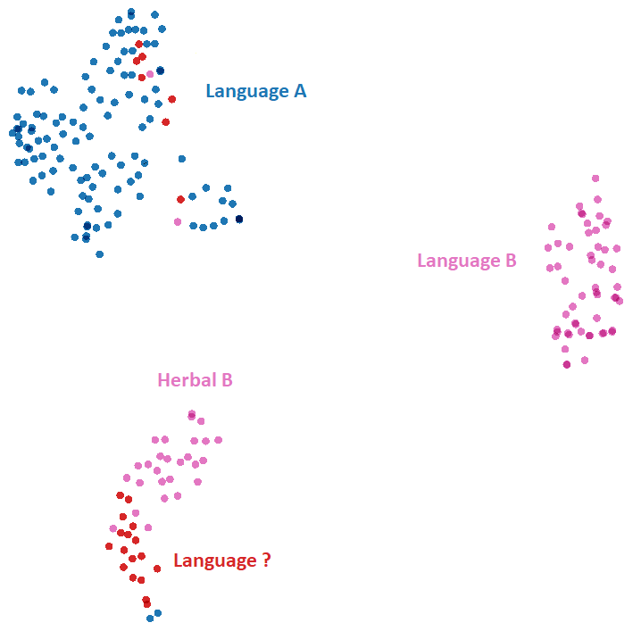
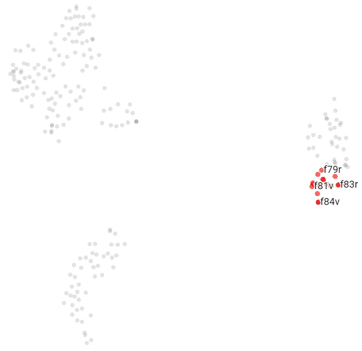
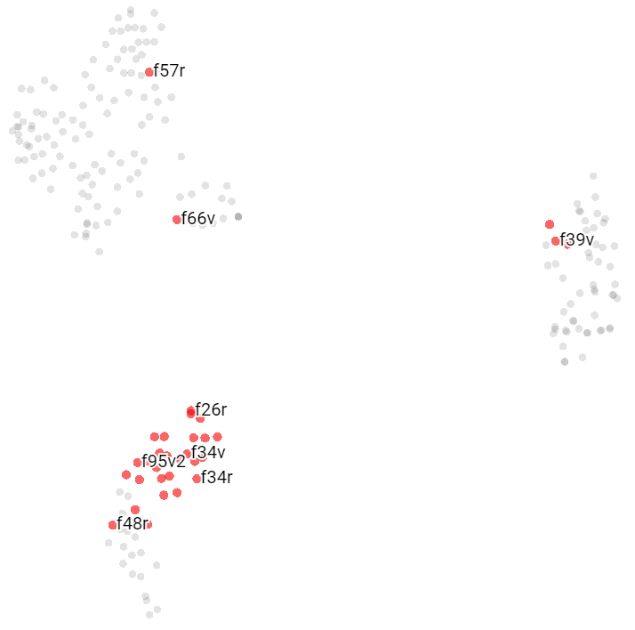
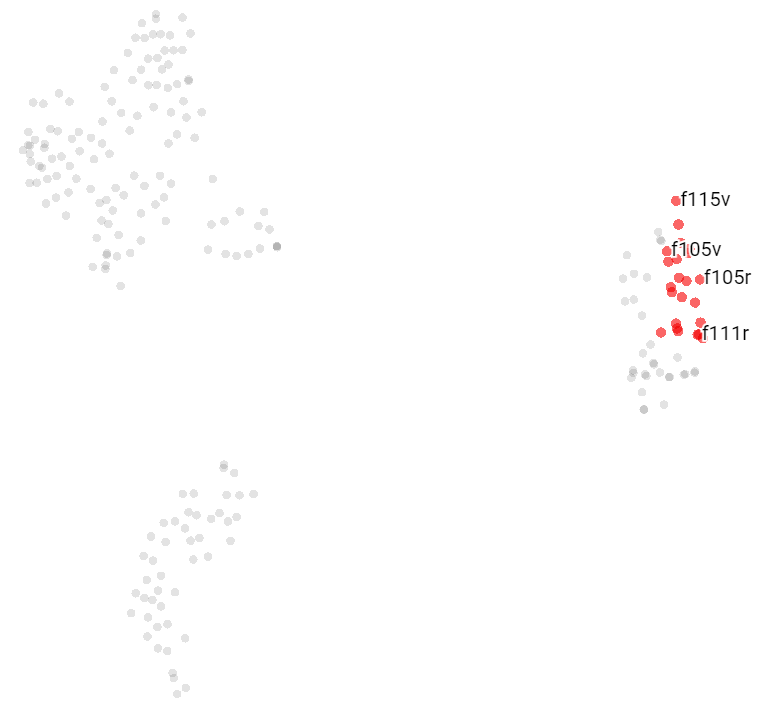

## Note 003 - Clustering

_Last updated Sep. 7th, 2021._

_This note refers to [release v.3.0.0](https://github.com/mzattera/v4j/tree/v.3.0.0) of v4j.
Some of the content might not apply to more recent versions of the library._

_Working notes are not providing detailed description of algorithms and classes sued, for this, please refer to the 
library code and JavaDoc._

# Abstract

# Previous Works

# Methodology

Our starting point is the Voynich majority transcription of the text (see [v4j README](https://github.com/mzattera/v4j#ivtff)).

## Embedding and Distance Measure

The text is split into units for analysis, that could be single pages or bigger portions of text (e.g. parchments / bi-folios).
Each unit is embedded as a bag of word where the dimensions are the "readable" words in the Voynich (that is, words with no
"unreadable" characters) and the value for the dimension is the number of times corresponding word appears in the text unit.

Similarity of textual unit is computed as positive angular distance of corresponding embedding; this returns angular distance
between two vectors assumed to have only positive components.

## Outliers

The class [`OutlierDetection`]() is used to look for "outliers", that is textual units which appear very dissimilar to other textual units
the output of the class can be seen [here]().
For single pages, we defined (quite arbitrarily :)) the following outliers, which are removed from the text before further analysis.

- **f65r**:
- **f116v**:
- **f53r**:
- **f27v**:
- **f68r2**:
- **f68r1**:
- **f57v**:
- **f72v1**:

## Preliminary Exploration

The [TensorBoard Embedding Projector](https://projector.tensorflow.org/) has been used to do a preliminary, quick and visual investigation
about clustering Voynich pages. The class [`BuildBoW`]() can be used to generate data suitable for visualization that can be uploaded to the projector;
its output for single pages can be found in [this folder]().
There is also a [pre-populated version of the projector](https://projector.tensorflow.org/?config=https://mzattera.github.io/v4j/003/data/projector_config.json),
that you can use for your own exploration.

The below images have been obtained using the projector with following parameters: T-SNE 2D projection, Perplexity=5, Learning rate=0.01, Supervise=0, Iteration=10'000.
 

#### Courier's Language

Pages tend to form three distinct clusters, which are highly correlated with Courier's languages (A or B).

- A cluster of pages using A language (in blue on top-left of the image).
- A cluster of pages using B language (in purple on right of the image).
- A cluster with a mix of "unclassified" pages (in red on the bottom-left), for which the language is not provided,
  and pages using B language (in purple on the bottom-left).
 

#### Biological Pages

These pages cluster closely together.
 

#### Cosmological Pages

These pages tends to disperse in the dimension space.
 

#### Herbal A Pages

The herbal pages written with Courier's language B tend to cluster together, well separated from Herbal B pages.
 

#### Pharmaceutical Pages

Those pages tend to cluster together with Herbal A; to be noticed that all Pharmaceutical pages are written
using Courier's language A and many Herbal A pages appears bounded with Pharmaceutical pages in the same parchment.
 

#### Herbal B Pages

The herbal pages written with Courier's language B tend to cluster together, well separated from Herbal A pages.
 

#### Stars Pages

The stars pages tend to cluster together.
 

#### Zodiac Pages

The zodiac pages tend to cluster together.
 

# Conclusions 

