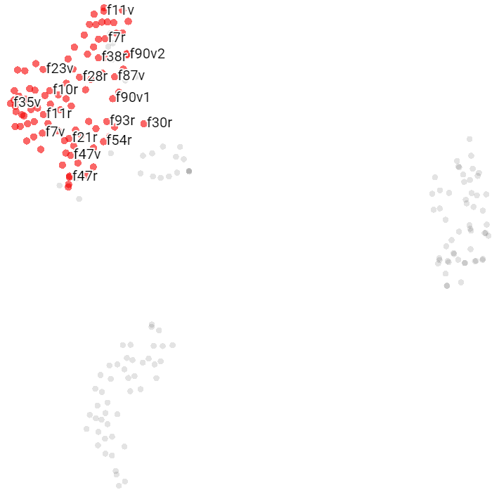
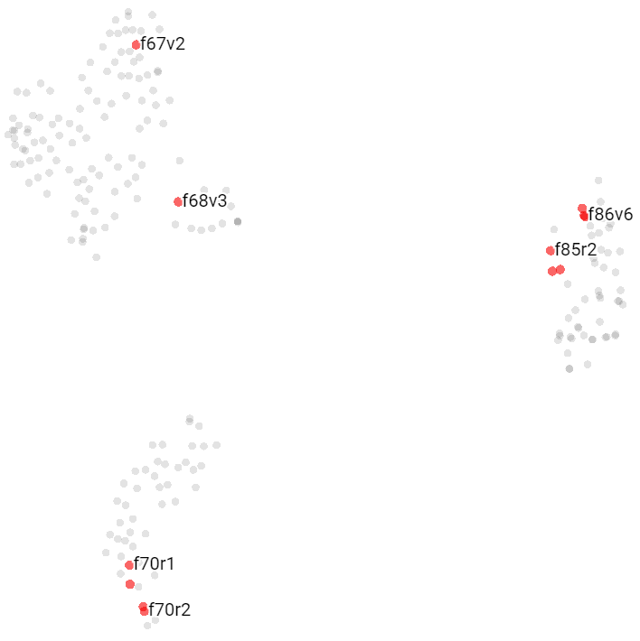

## Note 003 - Clustering

_Last updated Sep. 7th, 2021._

_This note refers to [release v.3.0.0](https://github.com/mzattera/v4j/tree/v.3.0.0) of v4j.
Some of the content might not apply to more recent versions of the library._

_Working notes are not providing detailed description of algorithms and classes used, for this, please refer to the 
library code and JavaDoc._

[**<< Home**](..)

---

# Abstract

# Previous Works

# Methodology

Our starting point is the Voynich majority transcription of the text (see [v4j README](https://github.com/mzattera/v4j#ivtff)).

## Embedding and Distance Measure

The text is split into units for analysis, that could be single pages or bigger portions of text (e.g. parchments / bi-folios).
Each unit is embedded as a bag of word where the dimensions are the "readable" words in the Voynich (that is, words with no
"unreadable" characters) and the value for the dimension is the number of times corresponding word appears in the text unit.

Similarity of textual unit is computed as positive angular distance of corresponding embedding; this returns angular distance
between two vectors assumed to have only positive components.

## Outliers

The class [`OutlierDetection`]() is used to look for "outliers", that is textual units which appear very dissimilar to other textual units
the output of the class (`PageEmbeddingDistance.xlsx`) can be seen in the [analysis folder]().
For single pages, we defined (quite arbitrarily :)) the following outliers, which are removed from the text before further analysis.

- **f65r**:
- **f116v**:
- **f53r**:
- **f27v**:
- **f68r2**:
- **f68r1**:
- **f57v**:
- **f72v1**:

## Preliminary Exploration

The [TensorBoard Embedding Projector](https://projector.tensorflow.org/) has been used to do a preliminary, quick and visual investigation
about clustering Voynich pages. The class [`BuildBoW`]() can be used to generate data suitable for visualization that can be uploaded to the projector;
its output can be found in [this folder]().
There is also a [pre-populated version of the projector](https://projector.tensorflow.org/?config=https://mzattera.github.io/v4j/003/data/projector_config.json),
that you can use for your own exploration.

The below images have been obtained using the projector with following parameters: T-SNE 2D projection, Perplexity=5, Learning rate=0.01, Supervise=0, Iteration=10'000.
 

#### Courier's Language

Pages tend to form three distinct clusters, which are highly correlated with Courier's languages (A or B).

- A cluster of pages using A language (in blue on top-left of the image), composed mostly by Pharmaceutical and Herbal A pages.
- A cluster of pages using B language (in purple on right of the image), composed mostly by Biological and Stars pages.
- A cluster with Zodiac pages (in red on the bottom-left), for which the language is not provided,
  together with Herbal pages using B language (in purple on the bottom-left).
 

#### Biological Pages

These pages cluster closely together.
 

#### Stars Pages

The stars pages tend to cluster together, nest to the Biological pages (they are all written in Courier's B language).
 

#### Herbal A Pages

The herbal pages written with Courier's language B tend to cluster together, well separated from Herbal B pages.
 

#### Pharmaceutical Pages

Those pages tend to cluster together, next to but separated from Herbal A; to be noticed that all Pharmaceutical pages are written
using Courier's language A and many Herbal A pages appears bounded with Pharmaceutical pages in the same parchment.
 

#### Herbal B Pages

The herbal pages written with Courier's language B tend to cluster together, well separated from Herbal A pages.
 

#### Zodiac Pages

The zodiac pages tend to cluster together, next to Herbal B pages.
 

#### Astronomical Pages

These pages are grouped in two big parchments; f67 and f68.

- f67r1, f67r2, and f68v2 are in the Zodiac cluster.
- f67v1 & f67v2 (technically a Cosmological page), f68v1, and f68r3 are in the Herbal A cluster.
- f68v3 (technically a Cosmological page) is in the Pharmaceutical cluster. 
- f68r1 and f68r2 are outliers.
 

#### Cosmological Pages

These pages tend to disperse in the dimension space.

- f69r, f69v , f70r1 and f70r2 (the verso of f70 being classified as Zodiac) are next to the Zodiac cluster.
- f85r2 is in the Language B cluster, together with f85r1 (which contains only Text) and f86v3-6; these are part of the fRos ("Big Rosetta") parchment, which clusters nearby.
- f57v is an outlier.
 

## K-Means Clustering

We can use K-Mean clustering to cluster the pages in the Voynich. Class `package io.github.mzattera.v4j.applications.clustering.KMeansClusterByWords`
does the clustering and prints out a report that can be easily converted in an Excel file; a copy of such file (`K-Means Clustering - Pages.xlsx`),
with some additional data, can be found in the [analysis folder](). The class can be parameterized to run different types of experiments;
keep in mind K-Means algorithm include some randomness, therefore slightly different clustering might result at each experiment.

The below table summarizes the result of clustering the manuscript pages:

We can see that:

- Biological pages are clearly clustered in their own cluster (#3).

- Other pages using language B (Cosmological, Stars and Herbal B) are grouped in the same cluster (#0).

- Herbal A and Pharmaceutical pages are in the remaining clusters;
  Herbal A is split in a bigger (#2) and a smaller (#1) group, while Pharmaceutical pages are grouped together
  with remaining Herbal A pages (#6).
  
In order to remove some noise, and noticing that in the vast majority of cases pages
in a parchment share illustration type and language, we performed the clustering again, this time
splitting the manuscript by parchment. Notice that parchments 29, 31, 32, 40 have been excluded
as they contain Cosmological or Astronomical pages, which we know already do not cluster well.

The results are shown below (they are also available in [the TensorFlow projector](https://projector.tensorflow.org/?config=https://mzattera.github.io/v4j/003/data/projector_config_parchments.json)).
 

We can see that there a strong tendency for parchments to cluster based on their illustration type and language, with two notable exceptions:

- Zodiac pages (parchments 33 and 34) which tend to remain separate.

- Parchment 33 which indeed is a strange bifolio combining two text pages, which also show stars (f58v and f58r), and
  two herbal pages; f65r which contains an illustration and a single label with two words, and f65v.

# Conclusions 

TODO

---

[**<< Home**](..)

Copyright Massimiliano Zattera.

 This work is licensed under a <a rel="license" href="http://creativecommons.org/licenses/by-nc-sa/4.0/">Creative Commons Attribution-NonCommercial-ShareAlike 4.0 International License</a>.
