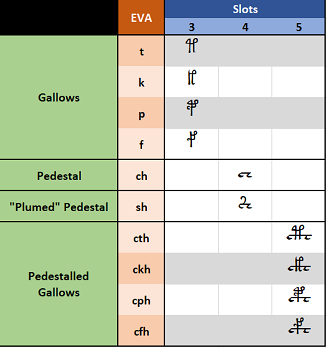
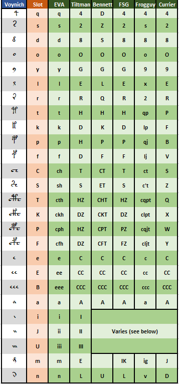

# Note 005 - Slots and a New Alphabet

_Last updated Sep. 12th, 2021._

_This note refers to [release v.5.0.0](https://github.com/mzattera/v4j/tree/v.5.0.0) of v4j;
**links to classes and files refer to this release**; files might have been changed, deleted or moved in the current master branch.
In addition, some of this note content might have become obsolete in more recent versions of the library._

_Working notes are not providing detailed description of algorithms and classes used; for this, please refer to the 
library code and JavaDoc._

_Please refer to the [home page](..) for a set of definitions that might be relevant for this working note._

[**<< Home**](..)

---


## Abstract

I show how the structure of Voynich words can be easily described by assuming each term is composed by "slots" that can be filled
accordingly to simple rules, which are described below.

This in turn sheds some lights on the definition of what constitute a Voynich character (the Voynich alphabet).

Given the nature of this topic, it is impossible to define rules that apply to 100% of cases; after all, syntactical and grammatical exceptions
exists in any modern text as well. However, I will try to focus on claims that apply to the vast majority of cases. 


## Previous Works

**TODO** _add the core/mantel/crust and the state machine works_.

- This approach is easier to explain and has more implications.


## Methodology

I start our analysis from a concordance version of the Voynich text (see [Note 001](../001)); this is obtained from the 
Landini-Stolfi Interlinear file by merging available interlinear transcriptions for each transcriber. In the merging, characters that are not
read by all authors in the same way are marked as unreadable. This to ensure the terms I will extract from the text are the most accurate.

For reasons explained below, any occurrence of the following characters is also marked as unreadable:

- 'g', 'x', 'v', 'u' (40 occurrences in total, in 13 of them these characters appear alone in the text).

- 'c' and 'h', when they do not appear in combinations such as 'ch', 'sh', 'cth', 'ckh', 'cph', 'cfh';
this sums up to 8 occurrences.

As a second step, **tokens** are created by splitting the text where a space was detected by at least one of the transcribers; there are 31'317 tokens in the text.

The list of **terms** is the list of tokens without repetition (this would be the "vocabulary" of the Voynich).
These 5'105 total terms have then been analyzed as explained below.


## Considerations

By looking at the terms in the Voynich, we can see their structure (that is, the sequence of Voynich glyphs used to write them) can be easily described
as follows:

- each term can be considered as composed by 12 "slots"; for convenience I will number them from 0 to 11.

- each slot can be empty or contain a single glyph. 

- the choice of glyphs that can occupy a slot is very limited and for 8 out of 12 slot it is as low as 2-3 possible glyphs.

- each glyph can appear in only one or two slots, with exception of 'd' that can appear in three different slots.

The below table summarizes these rules, showing the 12 slots and the glyphs that can occupy them.


To exemplify this concept, I show how some common terms can be decomposed in slots;

```
'daiin'

  0     1     2     3     4     5     6     7     8     9    10    11
[ d ] [   ] [   ] [   ] [   ] [   ] [   ] [   ] [ a ] [ii ] [ n ] [   ] 


'qokeedy'

  0     1     2     3     4     5     6     7     8     9    10    11
[ q ] [ o ] [   ] [ k ] [   ] [   ] [ee ] [ d ] [   ] [   ] [   ] [ y ] 


'opchedy'

  0     1     2     3     4     5     6     7     8     9    10    11
[   ] [ o ] [   ] [ p ] [ch ] [   ] [ e ] [ d ] [   ] [   ] [   ] [ y ]


'chcthor'

  0     1     2     3     4     5     6     7     8     9    10    11
[   ] [   ] [   ] [   ] [ch ] [cth] [   ] [   ] [ o ] [   ] [ r ] [   ] 
```

We can then see [{1}](#Note1) that tokens can be classified as follows:

- 27'743 tokens (88.6% of total), corresponding to 2'820 different terms (55.2% of total), can be decomposed in slots accordingly to the above rules. I will call these tokens "**regular**".

- 2'956 tokens (9.4% of total), corresponding to 1'856 different terms (36.4% of total), can be divided in two parts, each composed by at least two Voynich characters, 
where each of these parts is a regular term. I will call these tokens "**separable**".

  Moreover, we can see that for 1'379 separable terms (74.3% of total separable terms) their constituent parts appear as tokens in the text at least as often the whole
  separable term. For example, the term 'chockhy' appears 18 times in the text; it is a separable term that can be divided in two parts, each one being a regular term, as
  'cho'-'ckhy' which appear in the text 79 and 39 times respectively. I think this is an indication that many separable terms are possibly just two regular words that were written together
  (or the space between them was not read correctly by the transcriber of the text).
  When I need to distinguish these terms from other separable terms, I will call them **verified separable** or simply **verified**.

  **TODO** check the length of the parts and see if only short terms are joined. Check if separable tends to appear in tight spaces. 

- Remaining 618 tokens (2.0% of total), corresponding to 429 different terms (8.4% of total), are marked as "**unstructured**".

  **TODO** Show that vast majority of unstructured words appear only once in the text. This is probably true for separable too.

- Sometime I contrast regular and separable terms to unstructured ones by calling the former ***structured***.  

The below table summarizes these findings.


In short, almost 9 out of 10 tokens in the Voynich text exhibit a "slot" structure. Of the remaining, a fair amount can be decomposed in two parts each corresponding to regular terms
appearing elsewhere in the text. The remaining cases (2 out of 100) are mostly words appearing only once in the text.

**TODO** Char count by slot

**TODO** Decomposition by cluster.


### The Voynich Alphabet

The definition of the Voynich alphabet, that is of which glyphs should be considered a single Voynich character in the text, is still open.
Each transcriber must continuously decide what symbols in the manuscript constitute instances of the same glyph and how each glyph needs to be mapped into 
one or more transliteration characters.

However, if we consider the above defined slots as relevant for the structure of terms, we can reasonably assume that each glyph appearing in a slot constitutes a single Voynich character.
As far as I know, this is the first time that a possible Voynich alphabet is supported by empirical evidence of an inner structure of Voynich terms.

Below I analyze more in detail some relationships between glyphs, as they appear in slots, and EVA characters.


#### Rare Characters

The EVA characters 'g', 'x', 'v', and 'u' appear in the text only very few times, mostly as single characters, as shown in the table below.
For this reason, I decided to ignore these characters and mark them as "unreadable character" for this analysis.


Notice that through the Voynich there are several glyphs which cannot be directly transliterated into EVA characters (so called "weirdoes"); 
they are mostly ignored in any analysis of the text.


#### Gallows and Pedestals

Some glyphs (EVA 't', 'k', 'p' and 'f') appear taller than other characters and are traditionally referred to as "gallows".
The combination 'ch' is instead called "pedestal". Some glyphs (EVA 'cth', 'ckh', 'cph' and 'cfh') appear visually as a 
overlap of the pedestal with one of the gallows and therefore called "pedestalled gallows".
These glyphs appear in slots 3, 4, 5, and 7 and are shown in the below table.



It has been argued that pedestalled gallows might be a "ligature", that is a more compact from of writing a combination of the pedestal and a gallows character.
If we look at slots 3 through 5, we might think that pedestalled gallows can be indeed a combination of a gallows character followed by the pedestal, in this specific order.
However:

- The combination of gallows in slot 3, followed by a pedestal in slot 4 is quite common in the text (2'183 tokens) and written explicitly as two glyphs.
 
- There is never a case where a pedestal appears between 'e', 'ee' or 'eee' in slot 6 and a gallows character in slot 7.

This leads me to think pedestalled gallows are Voynich characters in their own, and not ligatures.

In addition, the character 'c' appears outside of the pedestal or pedestalled gallows only in 4 terms ('c', 'oc','chcpar', 'ckshy', and 'ocfshy'), each appearing only once in the text.
This is for me a strong indication that EVA 'c' does not correspond to a Voynich character.

Finally, the character 'h' appears outside of the pedestal, the pedestalled gallows or the glyph 'sh' only in 3 terms ('theody', 'docfhhy', and 'fhhy'), each appearing only once in the text.
Again, this seems a strong indication that EVA 'h' does not correspond to a Voynich character.


#### 'e' and 'i'

The characters 'e' and 'i' only appear in slots 6 and 9 respectively, in a sequence of 1, 2 or 3. Currier has assumed these sequences of same characters are 
single Voynich characters. Based upon how they appear in the slots, I think this is a reasonable assumption.


## The Slot Alphabet 

Finally, drawing from the above considerations, I propose a new transliteration alphabet, which I will call the **Slot alphabet** for obvious reasons.

I think that, being based on the inner structure of Voynich terms, this alphabet is more suitable than others when performing statistical analysis that relies on 
characters in words or when attempting to decipher the Voynich, where a closer correspondence between the transliteration characters and the Voynich character is paramount.

In addition, the alphabet can be easily converted into EVA, and vice-versa, therefore being used interchangeably.

The below table defines the Slots alphabet and compares it with other transliteration alphabets.



**TODO** i ii iii in alcuni alfabeti cambiano a seconda di come m r n sono trattate....evidenziarlo nella tabella.

**TODO** Create transliteration.

**TODO** Create HTML version.


## Conclusions 

- Inner structure of words, easier fro me to explain than Core or automata.

- Excludes any (simple) substitution cypher.

- This is the only alphabet that uses data-backed evidence in defining the char-set

- Voynich/EVA chars in slot cells constitute a morphological unit (character).

- It is important both for attacking the cypher and performing statistical analysis to have 1:1 mapping between Voynich and transliteration characters.

 
 
	
---

**Notes**

<a id="Note1">**{1}**</a> Class [`Slots`]() has been used to perform this analysis. An Excel with its output can be found in the
[analysis folder]().

---

[**<< Home**](..)

Copyright Massimiliano Zattera.

<a rel="license" href="http://creativecommons.org/licenses/by-nc-sa/4.0/"></a><br />This work is licensed under a <a rel="license" href="http://creativecommons.org/licenses/by-nc-sa/4.0/">Creative Commons Attribution-NonCommercial-ShareAlike 4.0 International License</a>.
