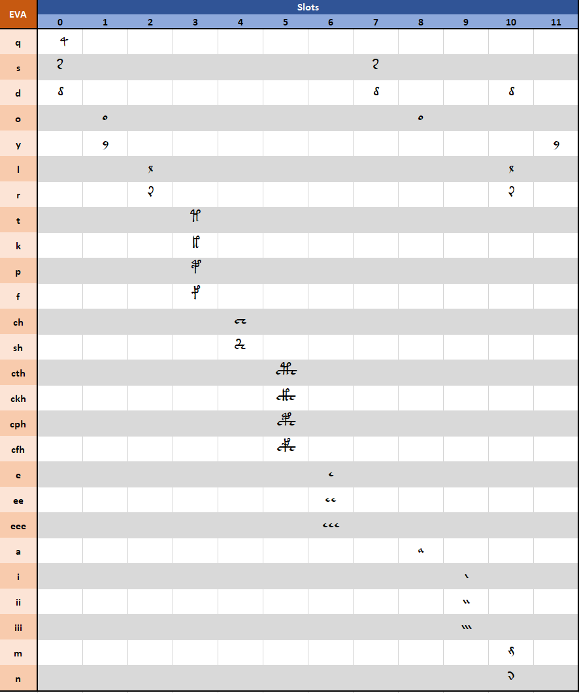
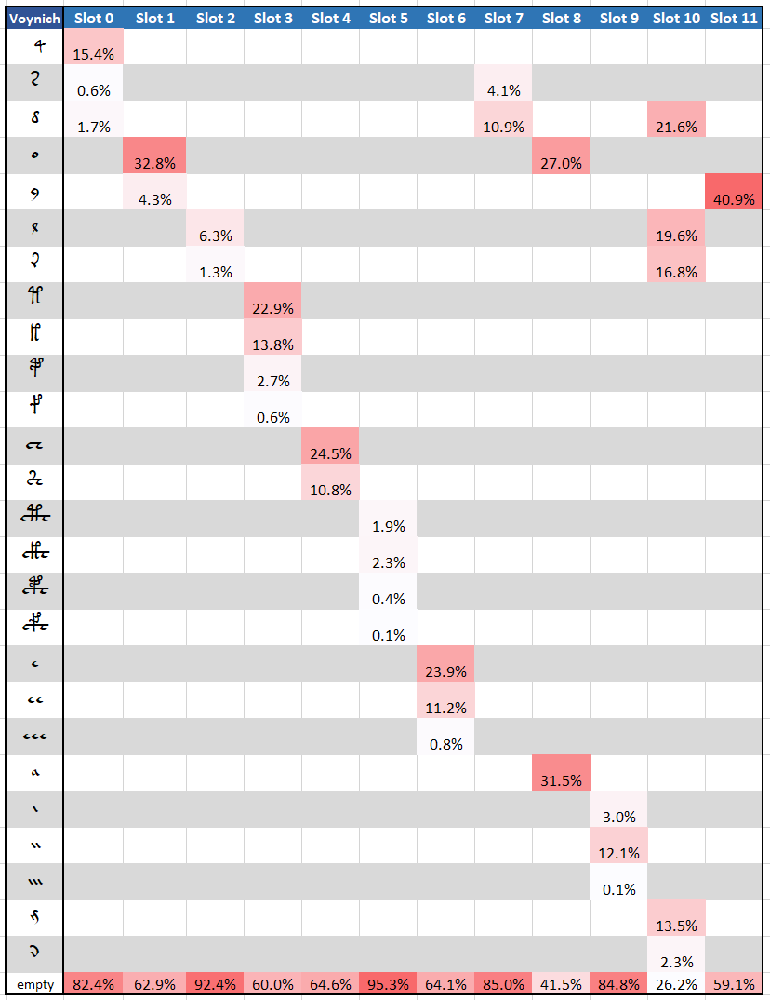
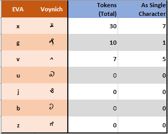

# Note 005 - Slots and a New Alphabet

_Last updated Oct. 23rd, 2021._

_This note refers to [release v.5.0.0](https://github.com/mzattera/v4j/tree/v.5.0.0) of v4j;
**links to classes and files refer to this release**; files might have been changed, deleted or moved in the current master branch.
In addition, some of this note content might have become obsolete in more recent versions of the library._

_Working notes are not providing detailed description of algorithms and classes used; for this, please refer to the 
library code and JavaDoc._

_Please refer to the [home page](..) for a set of definitions that might be relevant for this working note._

[**<< Home**](..)

---


## Abstract

I show how the structure of Voynich words can be easily described by assuming each term is composed by "slots" that can be filled
accordingly to simple rules, which are described below.

This in turn sheds some lights on the definition of what might constitute a Voynich character (the Voynich alphabet).

Given the nature of this topic, it is impossible to define rules that apply to 100% of cases; after all, syntactical and grammatical exceptions
exists in any modern text as well. However, I will try to focus on claims that apply to the vast majority of cases. 


## Methodology

I start our analysis from a concordance version of the Voynich text (see [Note 001](../001)); this is obtained from the 
Landini-Stolfi Interlinear file by merging available interlinear transcriptions for each transcriber. In the merging, characters that are not
read by all authors in the same way are marked as unreadable. This to ensure the terms I will extract from the text are the most accurate.

For reasons explained below, any occurrence of the following characters is also marked as unreadable:

- 'g', 'x', 'v', 'u', 'j', 'b', 'z' (47 occurrences in total, in 12 of them these characters appear alone in the text).

- 'c' and 'h', when they do not appear in combinations such as 'ch', 'sh', 'cth', 'ckh', 'cph', 'cfh';
this sums up to 8 occurrences.

As a second step, **tokens** are created by splitting the text where a space was detected by at least one of the transcribers; there are 31'317 tokens in the text,
ignoring those that contain an unreadable character.

The list of **terms** is the list of tokens without repetitions (this would be the "vocabulary" of the Voynich).
These 5'105 total terms have then been analyzed as explained below.


## Considerations

By looking at the terms in the Voynich, we can see their structure (that is, the sequence of Voynich glyphs used to write them) can be easily described
as follows:

- each term can be considered as composed by 12 "slots"; for convenience I will number them from 0 to 11.

- each slot can be empty or contain a single glyph. 

- the choice of glyphs that can occupy a slot is very limited and for 8 out of 12 slot it is as low as 2-3 possible glyphs.

- each glyph can appear in only one or two slots, with exception of 'd' that can appear in three different slots.

The below table summarizes these rules, showing the 12 slots and the glyphs that can occupy them.



To exemplify this concept, I show how some common terms can be decomposed in slots;

```
'daiin'

  0     1     2     3     4     5     6     7     8     9    10    11
[ d ] [   ] [   ] [   ] [   ] [   ] [   ] [   ] [ a ] [ii ] [ n ] [   ] 


'qokeedy'

  0     1     2     3     4     5     6     7     8     9    10    11
[ q ] [ o ] [   ] [ k ] [   ] [   ] [ee ] [ d ] [   ] [   ] [   ] [ y ] 


'opchedy'

  0     1     2     3     4     5     6     7     8     9    10    11
[   ] [ o ] [   ] [ p ] [ch ] [   ] [ e ] [ d ] [   ] [   ] [   ] [ y ]


'chcthor'

  0     1     2     3     4     5     6     7     8     9    10    11
[   ] [   ] [   ] [   ] [ch ] [cth] [   ] [   ] [ o ] [   ] [ r ] [   ] 
```

We can then see [{1}](#Note1) that tokens can be classified as follows:

- 27'743 tokens (88.6% of total), corresponding to 2'820 different terms (55.2% of total), can be decomposed in slots accordingly to the above rules. I will call these tokens "**regular**".

- 2'956 tokens (9.4% of total), corresponding to 1'856 different terms (36.4% of total), can be divided in two parts, each composed by at least two Voynich glyphs, 
where each of these parts is a regular term. I will call these tokens "**separable**".

  Moreover, we can see that for 1'379 separable terms (74.3% of total separable terms) their constituent parts appear as tokens in the text at least as often the whole
  separable term. For example, the term 'chockhy' appears 18 times in the text; it is a separable term that can be divided in two parts, each one being a regular term, as
  'cho'-'ckhy' which appear in the text 79 and 39 times respectively. I think this is an indication that many separable terms are possibly just two regular words that were written together
  (or the space between them was not read correctly by the transcriber of the text).
  When I need to distinguish these terms from other separable terms, I will call them "**verified separable**" or simply "**verified**".

- Remaining 618 tokens (2.0% of total), corresponding to 429 different terms (8.4% of total), are marked as "**unstructured**".

  Notice that 366 out of these 429 terms, or 85.3%, appear only once in the text; this percentage is 60.3% for regular and separable terms considered together.
  This might suggest that unstructured words are either typos or special words that are encoded differently than other words. if this would be the case, 
  it can be a situation similar to hieroglyphics where proper names are spelled phonetically, while common words are written pictorially using a single glyph.

- Sometime I contrast regular and separable terms to unstructured ones by calling the former "**structured**".  

The below tables summarize these findings.


In short, almost 9 out of 10 tokens in the Voynich text exhibit a "slot" structure. Of the remaining, a fair amount can be decomposed in two parts each corresponding to regular terms
appearing elsewhere in the text. The remaining cases (2 out of 100) are mostly words appearing only once in the text.

The below table shows occurrence of glyphs in slots for the regular tokens [{2}](#Note2).



As expected, the distribution of glyphs in slots varies based on Currier language and illustration:


## The Voynich Alphabet

The definition of the Voynich alphabet, that is of which glyphs should be considered a single Voynich character in the text, is still open.
Each transcriber must continuously decide what symbols in the manuscript constitute instances of the same glyph and how each glyph needs to be mapped into 
one or more transliteration characters.

However, if we consider the above defined slots as relevant for the structure of terms, we can reasonably assume that each glyph appearing in a slot constitutes a single Voynich character. In other words, if there is an inner structure of the words, as I think it has been demonstrated, and only some glyphs can appear in some parts of this structure,
it is reasonable to assume each glyph is a basic unit of information, that is a character in the Voynich alphabet.
As far as I know, this is the first time that a possible Voynich alphabet is supported by empirical evidence of an inner structure of Voynich terms.

Below I analyze more in detail some relationships between glyphs, as they appear in slots, and EVA characters.


#### Rare Characters

Some EVA characters appears in the original interlinear transliteration very seldom, end even less frequently in the concordance version used, 
where they appear mostly as single characters, as shown in the table below.
For this reason, I decided to ignore these characters and mark them as "unreadable character" for this analysis.



Notice that through the Voynich there are several glyphs which cannot be directly transliterated into EVA characters (so called "weirdoes"); 
they are mostly ignored in any analysis of the text.


#### Gallows and Pedestals

Some glyphs (EVA 't', 'k', 'p' and 'f') appear taller than other characters and are traditionally referred to as "gallows".
The combination 'ch' is instead called "pedestal". Some glyphs (EVA 'cth', 'ckh', 'cph' and 'cfh') appear visually as a 
overlap of the pedestal with one of the gallows and therefore called "pedestalled gallows".
These glyphs appear in slots 3, 4, 5, and 7 and are shown in the below table.


It has been hypothesized (e.g. [TILTMAN (1967)](../biblio.md) p.7 point (b.)) that pedestalled gallows might be a "ligature",
that is a more compact from of writing a combination of the pedestal and a gallows character.
If we look at slots 3 through 5, we might think that pedestalled gallows can be indeed a combination of a gallows character followed by the pedestal, in this specific order.
However:

- The combination of gallows in slot 3, followed by a pedestal in slot 4 is quite common in the text (2'183 tokens) and written explicitly as two glyphs.
 
- There is never a case where a pedestal appears between 'e', 'ee' or 'eee' in slot 6 and a gallows character in slot 7.

This leads me to think pedestalled gallows are Voynich characters in their own, and not ligatures.

In addition, the character 'c' appears outside of the pedestal or pedestalled gallows only in 4 terms ('c', 'oc','chcpar', 'ckshy', and 'ocfshy'), each appearing only once in the text.
This is for me a strong indication that EVA 'c' does not correspond to a Voynich character.

Finally, the character 'h' appears outside of the pedestal, the pedestalled gallows or the "plumed" pedestal ('sh') only in 3 terms ('theody', 'docfhhy', and 'fhhy'),
each appearing only once in the text. Again, this seems a strong indication that EVA 'h' does not correspond to a Voynich character.


#### 'e' and 'i'

The characters 'e' and 'i' only appear in slots 6 and 9 respectively, in a sequence of 1, 2 or 3. Some transcribers, like Currier, have assumed some of these sequences to be a single Voynich character.

It can be argued that these are indeed repetitions of the same character but, if this is the case, as these sequences
appear always in same slots, what it is relevant here would be the number of repetitions. In other words, as it 
happens for Roman numerals the sequence VI must not be understood as a 2-character word, rather as the number 6.

In addition, it should be noted that several characters in the Latin script might appear as repetitions of the same
character, when written by hand; for example "m" looks like "nn", "w" can be read as "uu", but these are single characters.

Based on the above, I assume each sequence of 'e' and 'i' is probably a character in itself (or anyway a single "unit", like in Italian where, even if "q" and "u" are distinct letters,
"q" appears only in "qu-").


## The Slot Alphabet 

Finally, drawing from the above considerations, I propose a new transliteration alphabet, which I will call the **Slot alphabet** for obvious reasons.

I think that, being based on the inner structure of Voynich terms, this alphabet is more suitable than others when performing statistical analysis that relies on characters in words or when attempting to decipher the Voynich,
where a one-to-one correspondence between the transliteration characters and the Voynich characters is paramount.

In addition, the alphabet can be easily converted into EVA, and vice-versa, therefore being used interchangeably.

The below table defines the Slots alphabet and compares it with other transliteration alphabets.


  In some of the above alphabets, sequences of EVA 'i' are treated differently, depending on the letter following the sequence.
Therefore, there is no unique way to transliterate sequences of 'i' into these alphabets without looking at the whole Voynich word being transliterated.

  For Titlman, 'p' and 'f' are variant forms of 't' and 'k' respectively;
similarly 'cph' and 'cfh' are variants for 'cth' and 'ckh'. I assume EVA 'm' is transliterated as a variant of 'l' (Tiltman's 'E').

A [transliteration](https://github.com/mzattera/v4j/blob/master/eclipse/io.github.mzattera.v4j/src/main/resources/Transcriptions/Interlinear_slot_ivtff_1.5.txt)
of the Landini-Stolfi interlinear file that uses the Slot alphabet is available within
[v4j library](https://github.com/mzattera/v4j#ivtff) and accessible using `VoynichFactory` factory methods.


## Comparisons with Previous Works

I am not the first one analyzing the internal structure of Voynich words; as this section is going to be long and possibly continuously updated,
I created a [separate page](../006).


## Conclusions 

- Majority of words in the Voynich exhibits an inner structure described here, where terms can be represented as composed by 12 "slots" that can be left empty or 
populated by a single glyph chosen among a very limited group of glyphs (usually 2-3).

  - 88.6% of tokens (55.2% of terms) exhibit this structure (**regular** terms).
  
  - 9.4% of tokens (36.4% of terms) can be divided in two parts, each presenting the inner structure described above (**separable** terms). 
  
    For 74.3% of separable terms, their two constituents appear in the text more often than the separable term itself (**verified separable** terms).
  
    This seems a strong indication that separable terms are made by two regular terms written together.
  
  - only 2.0% of tokens (8.4% of terms) do not exhibit this structure (**unstructured** terms).
  
    85.3% of unstructured terms appears only once in the text. In other words, **only 0.8% of tokens (1.2% of terms) are unstructured terms appearing at least twice in the text**.
	
	I argue that these can be typos or plain text words encoded in a different way than the majority of the text (e.g. because they represent names or "incantations").
	
- I think the above evidence supports the idea that "slots" are a significant structural component of Voynich words.

- If so, it is reasonable to assume that glyphs appearing in slots are basic unit of information; in other words, these should be the characters of the Voynich alphabet.
This led the creation of a new transliteration alphabet presented here, the **Slot alphabet**.

  A [transliteration](https://github.com/mzattera/v4j/blob/master/eclipse/io.github.mzattera.v4j/src/main/resources/Transcriptions/Interlinear_slot_ivtff_1.5.txt)
of the Landini-Stolfi interlinear file that uses the Slot alphabet is available

- As far as I know, Slot alphabet is the first one that is based on empirical data about the structure of Voynich words, trying to capture the intent of the 
Voynich author.

  I think this is an important aspect to consider, both for attacking the Voynich cypher and performing statistical analysis of the manuscript, 
when a one-to-one mapping between the Voynich characters and those in the transliteration alphabet is crucial.

- In addition, slots shows that next unit of information above characters are indeed words in the Voynich text. This does not mean that words in Voynich are
actual words in a the plain text, but shows that they are indeed a logic building block of the text.

  _There might be an indication that lines and paragraphs are the next logical levels, this is left for further investigations._

- Slots should be considered when attempting to decipher the text. Whether the Voynich has been created by encoding a plain text or by a mechanical process, 
slots must be the basis of such mechanisms.
  
- Slots described here apply to the whole of the Voynich text; this was not granted, as we know there are differences in the text (e.g. different character distribution 
between language A and B, different word endings, etc.). This might suggest the text was generated by using the same process across the entire book.
Whether the differences we see in the text are the result of different "settings" used on the process or the effect of differences in the plain text possibly encoded,
is still impossible to say.

- Since no natural language presents such an inner structure, the existence of "slots" constitutes a strong objection to any attempt to propose a substitution cipher for the Voynich.

  This was pointed out as early as in [TILTMAN (1967)](../biblio.md) (p. 9 paragraph (o)).

- Similarly, the "slot" structure of words will condition character entropy in the text. Therefore, attempts to assign a natural language to the Voynich by looking at similarities in
character entropy seem not to be based on solid ground.

  
	
---

**Notes**

<a id="Note1">**{1}**</a> Class
[`Slots`](https://github.com/mzattera/v4j/blob/v.5.0.0/eclipse/io.github.mzattera.v4j-apps/src/main/java/io/github/mattera/v4j/applications/slot/Slots.java)
has been used to perform this analysis. An Excel with its output can be found in the
[analysis folder](https://github.com/mzattera/v4j/tree/master/resources/analysis/slots).

<a id="Note2">**{2}**</a> Class
[`CountCharsBySlot`](https://github.com/mzattera/v4j/blob/v.5.0.0/eclipse/io.github.mzattera.v4j-apps/src/main/java/io/github/mattera/v4j/applications/slot/CountCharsBySlot.java)
has been used to produce this table.

<a id="Note3">**{3}**</a> Personal communication, October 2021.


---

[**<< Home**](..)

Copyright Massimiliano Zattera.

<a rel="license" href="http://creativecommons.org/licenses/by-nc-sa/4.0/"></a><br />This work is licensed under a <a rel="license" href="http://creativecommons.org/licenses/by-nc-sa/4.0/">Creative Commons Attribution-NonCommercial-ShareAlike 4.0 International License</a>.
