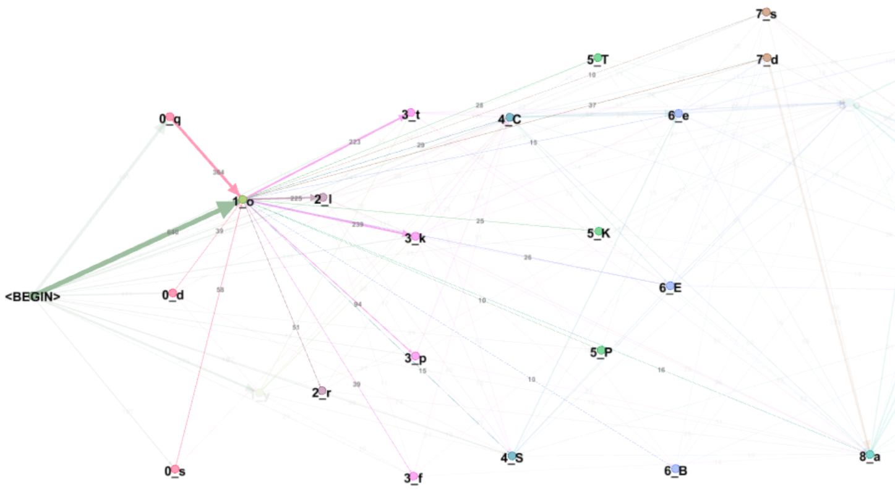
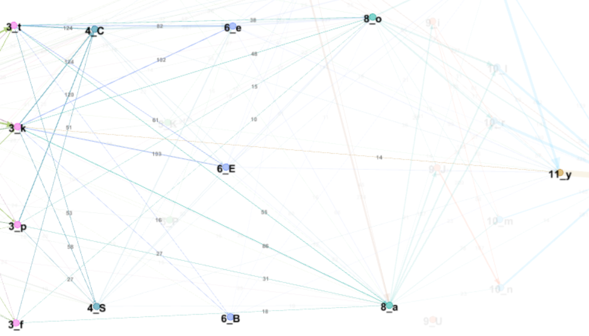
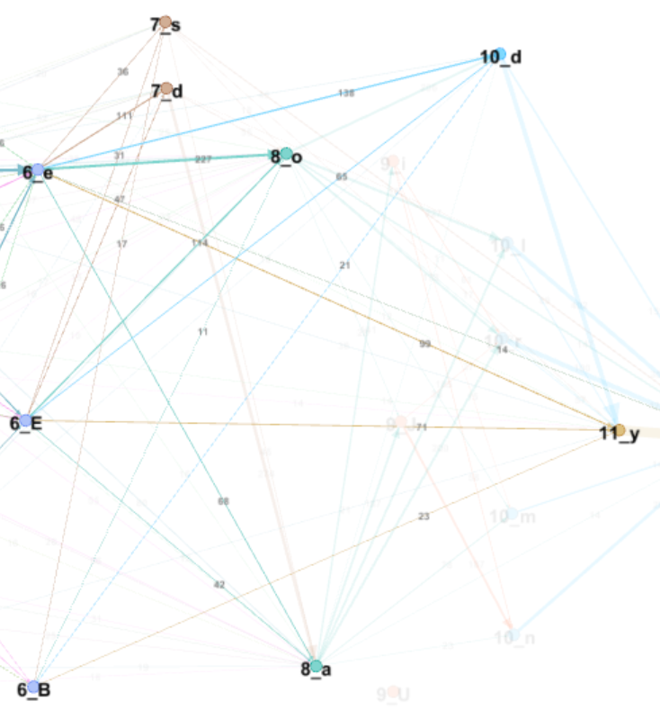
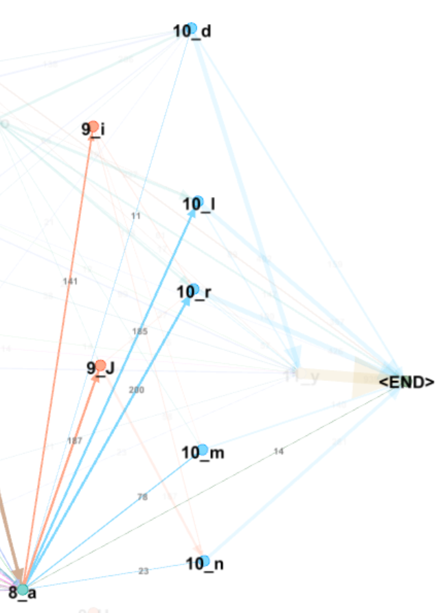
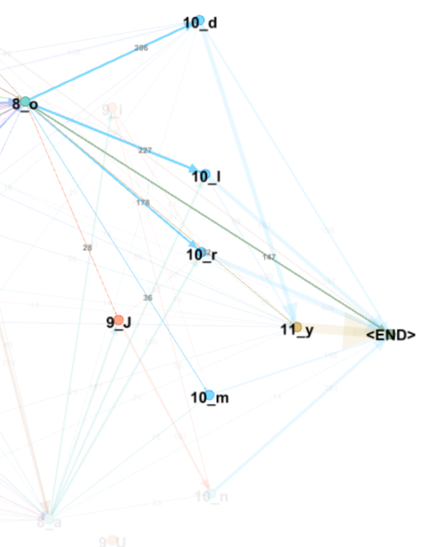

# Note 007 - A Graph View on Word Structure

_Last updated Feb. 21st, 2022._

_This note refers to [release v.8.0.0](https://github.com/mzattera/v4j/tree/v.8.0.0) of v4j;
**links to classes and files refer to this release**; files might have been changed, deleted or moved in the current master branch.
In addition, some of this note content might have become obsolete in more recent versions of the library._

_Working notes are not providing detailed description of algorithms and classes used; for this, please refer to the 
library code and JavaDoc._

_Please refer to the [home page](..) for a set of definitions that might be relevant for this working note._

[**<< Home**](..)

---

**Unless differently noted, this pages uses the Slot alphabet to transliterate Voynich words.**

**For a better viewing, it is suggested to right click on the images and open them in a different browser tab.**

# Abstract

In this note, I create and analyze a graph showing connections between characters in Voynich word types accordingly to my [slot model](../005) [{1}](#Note1);
unless differently mentioned, the Slot alphabet is used.

 

# Methodology

I created a graph where nodes are characters in their slots; e.g. "1_o" represent character 'o' in slot number 1. 

After that, I connected node A with node B if there is a regular word type in the Voynich where character B follows directly character A;
connections are therefore represented a directed edges with a weight equal to the number of regular word types where the characters are connected.
For visualization purposes, I removed all edges with a weight less than 10 [{2}](#Note2). 

The resulting graph is shown below and commented further.

# Analysis

Here i analyze char connections slot by slot.

## Slot 0

Characters in slot 0 behave quite different one another.

'q' connects exclusively with 'o' in slot 1:

'd' connects with 'o' and 'y' in slot 1 or pedestals:

's' connects with 'o' in slot 1 or 'C' (pedestal):

## Slot 1

'o' connects basically with any other character up to slot 8; it seems to be the most "connected" character:

'y',  optionally preceded by a 'd', connects to gallows in slots 3 or pedestals (but NOT with pedestalled gallows):

## Slot 2

'l' and 'r' here behave very differently.

'l', eventually preceded by 'o', connects to gallows (but NOT with pedestalled gallows), pedestals, 's' or 'd' in slot 7, and 'o' or 'a' in slot 8:

'r', eventually preceded by 'o', connects only to pedestals, and 'o' or 'a' in slot 8, not to gallows or slot 7:

## Slot 3

Gallows in slot 3 behave very similarly; they are followed by a pedestal, an 'e' sequence, or  'o' and 'a' in slot 8.
'k' also links, more weakly, to the ending 'y' in slot 11.

## Slot 4

Pedestals in slot 4 behave in slightly different ways.

As mentioned, they are preceded by same letters, with the exception that 'C' can be preceded by 's', which does not happen with 'S'.

'S' connects to slots 6 ('e' sequences) or 8 ('a' and 'o') in addition to 'd' in slot 7 and 10 and final 'y' in slot 11:

In addition to the above connections, 'C' connects to pedestalled gallows in slot 5, and 's' in slot 7:

## Slot 5

Pedestalled gallows in slot 5 appear relatively seldom, they behaves in the same way.

They might be preceded by 'o' or 'C' and followed by 'e' (slot 6), 'a' or 'o' (slot 8), or the final 'y' in slot 11:

## Slot 6

Sequences of 'e' in slot 6 ('e', 'E', 'B') seem to behave in the same way.

They connect into next slots 7 and 8, 'd' in slot 10 or the word final 'y'.

## Slot 7 

Characters in slot 7 are followed by 'o' and 'a' in slot 8 or the word ending 'y'. Notice 'd' followed by 'a' is very common; in addition, 'd' can also be followed by 'l', which does not happen with 's'.

## Slot 8 

'o' and 'a' in slot 8 seem to act as a "bridge" between the previous slots and slots 9 ('i' sequences) and 10 ('d', 'l', 'm', and 'n');
where slots before 8 connects to slots 9-10 only through slot 8 (with the exception of 7_d - 10_l sequence).

The main differences are:

* 'a' has a stronger tendency than 'o' to be preceded by 'd' in slot 7, whilst 'o', is mostly preceded by 'e' sequences.

* 'a' tends to be followed more often than 'o' by 'i' or 'J'; it also connect to 'n', which 'o' does not.

* 'o' can be followed by the word-ending 'y', 'a' does not; in addition, 'o' connects very strongly with 'd'.

'a' behavior:

'o' behavior:

## Slot 9 

This slot contains sequences of 'i' ('i', 'J', 'U').

They are preceded only by 'o' or 'a' in slot 8 and connect only to slot 10. Notice they are not followed by 'd' or 'l' in this slot.

## Slot 10 

Letters in slot 10 are preceded by those in slots 8 and 9.

'd' is mostly preceded by 'o' and optionally followed by a word ending 'y'.

'l', 'r', 'm', 'n' can be preceded by 'o', 'a' (slot 8) or an 'i' sequence (slot 9); 'l' is the only one that can be preceded by a 'd' in slot 7.

Noticeable difference is that, while 'l' and 'r' can be followed by the word final 'y'...

..., 'm' and 'n' are mostly word ending.

## Slot 11

This slot contains the word ending 'y' alone.

# Considerations

1_o can be followed basically from any other character; this might signify that the initial o- or even qo- (given that 'q' mostly pairs with 'o' at the beginning of a word)
have a special meaning, that they are not "normal" characters.

Less surprising the peculiar role of 'i' sequences, mostly appearing as a(i,ii)(r,n) sequences.

# Conclusions

This analysis shows that there is a dependency between one character and those preceding it. In other word types,
Voynich words are not generated by randomly putting proper chars into slots.

It also shows that, given a character, we have a limited choice of options for the characters following it;
this means that the information encoded by each single character is not much. Compared to modern languages,
where a position in a text can encode 4-5 bits (it can be occupied by any of about 25 letters),
a position in a Voynich word can be filled only by a smaller set of symbols, this encoding less information.

In addition, it is clear that characters have a different role based on the slot they appear; so 
'o' in slot 1 (1_o) has not the same "meaning" or "function" than the same character in slot 8 (8_o).

Finally, the letter 'o' in slot 1 seems to connect to far more other characters than other letters.
This might suggest some special role of 'o', which is also hinted in Cham's article about 
his [Curve-Line System](../006) (CLS). 
	
---

**Notes**

<a id="Note1">**{1}**</a> Class [`BuildSlotStateMachine`](https://github.com/mzattera/v4j/blob/v.8.0.0/eclipse/io.github.mzattera.v4j-apps/src/main/java/io/github/mzattera/v4j/applications/slot/BuildSlotStateMachine.java) was used to generate the graph,
that was then visualized using [Gephi](https://gephi.org/); the resulting Gephi workbench (`CharSequence.gephi`) is stored [here](https://github.com/mzattera/v4j/tree/master/resources/analysis/slots).

Please notice package [`io.github.mzattera.v4j.util.statemachine`](https://github.com/mzattera/v4j/tree/v.8.0.0/eclipse/io.github.mzattera.v4j/src/main/java/io/github/mzattera/v4j/util/statemachine) provides classes to represent state machines, which are used by `BuildSlotStateMachine`.

<a id="Note2">**{2}**</a> As you can see 
from the [glyph count by slot](../005/#GliphCountImg), some glyphs appear in less than 1% of the word types, that means they will
have less than 26 total incoming edges, therefore they might look disconnected in this graph.

---

[**<< Home**](..)

Copyright Massimiliano Zattera.

 This work is licensed under a <a rel="license" href="http://creativecommons.org/licenses/by-nc-sa/4.0/">Creative Commons Attribution-NonCommercial-ShareAlike 4.0 International License</a>.
